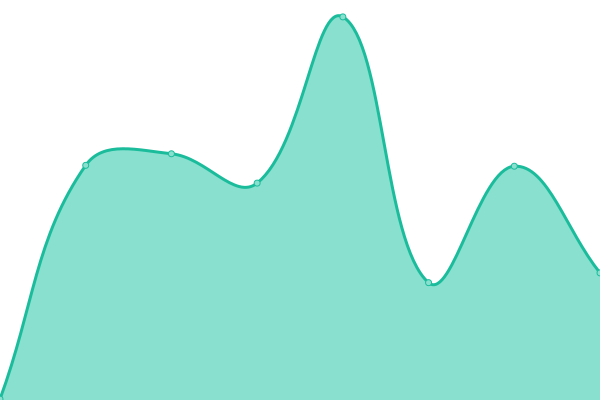
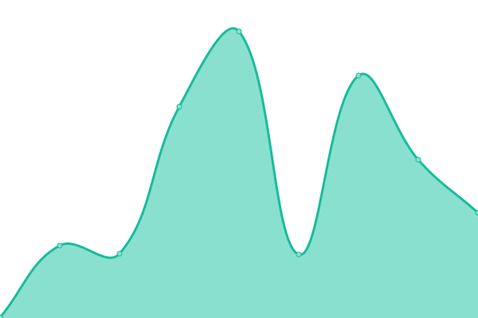

# [📈 Live Status](https://status.kinfolk.vc): <!--live status--> **🟩 All systems operational**

This repository contains the open-source uptime monitor and status page for [kinfolkVC](https://status.kinfolk.vc), powered by [Upptime](https://github.com/upptime/upptime).

With [Upptime](https://upptime.js.org), you can get your own unlimited and free uptime monitor and status page, powered entirely by a GitHub repository. We use [Issues](https://github.com/kinfolkVC/status/issues) as incident reports, [Actions](https://github.com/kinfolkVC/status/actions) as uptime monitors, and [Pages](https://status.kinfolk.vc) for the status page.

<!--start: status pages-->
<!-- This summary is generated by Upptime (https://github.com/upptime/upptime) -->
<!-- Do not edit this manually, your changes will be overwritten -->
<!-- prettier-ignore -->
| URL | Status | History | Response Time | Uptime |
| --- | ------ | ------- | ------------- | ------ |
|  [Kinfolk Onyx Api](https://api.kinfolk.vc) | 🟩 Up | [kinfolk-onyx-api.yml](https://github.com/KinfolkVC/status/commits/HEAD/history/kinfolk-onyx-api.yml) | 

 210ms
     
 | 

<a href="https://status.kinfolk.vc/history/kinfolk-onyx-api">100.00%</a>
    

|  [Kinfolk Onyx User](https://onyx.kinfolk.vc) | 🟩 Up | [kinfolk-onyx-user.yml](https://github.com/KinfolkVC/status/commits/HEAD/history/kinfolk-onyx-user.yml) | 

 277ms
     
 | 

<a href="https://status.kinfolk.vc/history/kinfolk-onyx-user">100.00%</a>
    

|  [Kinfolk Onyx Admin](https://admin.kinfolk.vc) | 🟩 Up | [kinfolk-onyx-admin.yml](https://github.com/KinfolkVC/status/commits/HEAD/history/kinfolk-onyx-admin.yml) | 

 144ms
     
 | 

<a href="https://status.kinfolk.vc/history/kinfolk-onyx-admin">100.00%</a>
    

|  [Kinfolk Website](https://kinfolk.vc) | 🟩 Up | [kinfolk-website.yml](https://github.com/KinfolkVC/status/commits/HEAD/history/kinfolk-website.yml) | 

 157ms
     
 | 

<a href="https://status.kinfolk.vc/history/kinfolk-website">100.00%</a>
    

<!--end: status pages-->

[**Visit our status website →**](https://status.kinfolk.vc)

## 📄 License

- Powered by: [Upptime](https://github.com/upptime/upptime)
- Code: [MIT](./LICENSE) © [kinfolkVC](https://status.kinfolk.vc)
- Data in the `./history` directory: [Open Database License](https://opendatacommons.org/licenses/odbl/1-0/)
